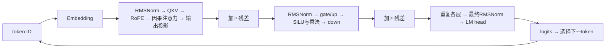

# Transformer 与自回归推理：从 token 到 KV cache

自回归语言模型用已有 token 预测下一个 token。量化所改变的权重、激活和 KV cache 位于同一条计算链的不同位置。本页以 Llama 风格的稠密、pre-norm、因果 decoder 为例，先给出逻辑计算，再与 vLLM、SGLang 的实现衔接；不把这一结构当作所有 Transformer 的定义。

## 1. 一次前向究竟输入和输出什么

设词表大小为 $V$，隐藏维为 $D$，当前参与计算的 token 数为 $T$。token ID 经 embedding 得到 $X\in\mathbb R^{T\times D}$，逐层更新后，经最终归一化与 LM head 得到 logits $Z\in\mathbb R^{T\times V}$。第 $t$ 行经 softmax 表示 $p(x_{t+1}\mid x_{\le t})$；贪心选择或采样决定下一个 token。词表概率不等于任意问答任务上的“答案正确概率”。

图中省略了从每个子层输入到残差相加点的旁路。记 $N$ 为 RMSNorm，则一层的逻辑公式是

$$H=X+\operatorname{Attention}(N(X)),\qquad
X'=H+\bigl[\operatorname{SiLU}(N(H)W_g)\odot N(H)W_u\bigr]W_d.$$

这里 $W_g,W_u\in\mathbb R^{D\times F}$、$W_d\in\mathbb R^{F\times D}$，$F$ 是 MLP 中间宽度。正文使用右乘矩阵，PyTorch 的 `Linear.weight` 通常保存其转置，见 [线性层与输入通道](../operators/linear-layer-input-channel.md)。非线性和残差限制了变换可以搬动的位置，这正是 [等价缩放](../../theory/diagonal-scaling-equivalent-transform.md)需要逐接口证明的原因。

vLLM `LlamaDecoderLayer.forward` 将残差保存在另一条张量流中，交给 RMSNorm 融合相加；源码返回两条流，不表示数学图没有残差。舍入顺序与融合语义见 [RMSNorm 实现](../../implementation/rmsnorm-cuda-triton-kernels.md)。

## 2. Q、K、V 的形状与共享关系

设 query head 数为 $H_q$，KV head 数为 $H_{kv}$，每头维度为 $d$。投影后：

| 张量 | 逻辑形状 | 作用 |
| --- | --- | --- |
| Q | $[T,H_q,d]$ | 当前 token 对历史信息的查询 |
| K | $[T,H_{kv},d]$ | 当前 token 将来被查询时的匹配特征 |
| V | $[T,H_{kv},d]$ | 匹配后参与加权求和的内容 |

通常 $D=H_qd$，但应以模型配置为准。MHA 取 $H_{kv}=H_q$；MQA 取 $H_{kv}=1$；GQA 介于两者之间。整除且连续分组时，query head $h$ 使用 KV head $g(h)=\lfloor h/(H_q/H_{kv})\rfloor$。共享的是 K/V，query heads 仍有各自的 Q 与注意力分布。

标准 RoPE 对位置相关的 Q、K 二维坐标对施加旋转；V 不做该旋转。记旋转后为 $\widetilde Q,\widetilde K$，位置 $t$ 的一头输出为

$$a_{t,j,h}=\operatorname{softmax}_{j\le t}
\left(\frac{\widetilde Q_{t,h}\widetilde K_{j,g(h)}^\top}{\sqrt d}\right),\qquad
O_{t,h}=\sum_{j\le t}a_{t,j,h}V_{j,g(h)}.$$

因果 mask 在 softmax **之前**排除未来位置，否则未来值已经影响归一化分母。拼接各 query head 后，$[T,H_qd]$ 经过输出投影回到 $[T,D]$。`LlamaAttention.forward` 的 QKV split → rotary → attention → o_proj 对应这条链；实现通常融合计算，不要求物化完整注意力矩阵。分页与在线 softmax 见 [vLLM Attention](../../implementation/vllm-attention-operator-design.md)。

## 3. Prefill、decode 与 teacher forcing

输入有 $P$ 个 token 时，prefill 同时计算这些位置。因果 mask 使它们只能看各自前缀；最后位置的 logits 用来选择第一个生成 token。随后把这个新 token 输入模型，利用已有 KV 计算下一轮 logits。**选择一个 token 与把它送入模型形成 KV 是相邻的两个步骤**，不能把“已经采样”直接当作“已经缓存”。

Teacher forcing 给每个位置真实的前文 token，因此可以同时计算整段序列的 next-token 损失。自由生成则把模型自己的输出接回输入，一个早期差异会改变后续上下文。所以 [PPL 评测](../../implementation/model-quality-evaluation.md)与生成问答准确率衡量的行为不同。

调度可把 prefill 分段，也可把多个请求的 decode 合并。线性层的 GEMM 行数 $M$ 是本轮实际送入的 token 数：8 个请求各推进一个 token 时 $M=8$，并非 8 次必须独立执行的 GEMV。prefill/decode 是请求进度语义，不能单独决定算子的形状或瓶颈；详见 [vLLM token 调度](../../implementation/vllm-inference-execution.md)与 [roofline](../hardware/arithmetic-intensity-and-roofline.md)。

## 4. 为什么缓存 K/V，而不是每轮重算历史

固定模型、位置与前缀，在因果推理中，新增未来 token 不改变历史 token 已经算出的 K/V。因而每层只追加新 token 的 K/V，后续查询复用它们。历史 Q 对以后的位置没有直接用途，logits 是词表空间的预测，也不能替代每层的 K/V。

单请求长度为 $L$、层数为 $N_l$、每个缓存元素为 $b$ 字节时，不计量化元数据和分配浪费，逻辑 KV 大小为

$$B_{KV}=2N_lLH_{kv}db.$$

教学例：$N_l=32,L=2048,H_{kv}=8,d=128,b=2$，共 256 MiB；同样条件下 MHA 若 $H_{kv}=32$，则为 1 GiB。这是全模型逻辑缓存，不是某个 TP rank 的实际分配量。分页、复制、共享前缀及量化元数据都可能改变实占。

缓存复用依赖模型权重、位置规则与前缀身份。改变这些条件后，旧 KV 不自动仍然有效。KV 数值在线产生，但量化策略与某些变换可离线校准；历史可通过重新前向恢复，只是有计算成本。机制见 [KV cache 量化](../../theory/kv-cache-quantization-objects-and-granularity.md)，管理见 [SGLang 缓存与调度](../../implementation/sglang-inference-execution.md)。

## 5. 从逻辑图进入代码与量化

vLLM 与 SGLang 所选 `llama.py` 都把 gate/up 合并投影，把 Q/K/V 合并投影，再使用行并行的 down/o 投影。这减少或组织调用，同时给分片布局施加约束，见 [张量并行与量化分片](../../implementation/tensor-parallel-quantization.md)。

权重量化改变这些投影的参数表示；激活量化改变进入乘法的中间张量；KV 量化改变跨轮保存的 K/V。三者作用的时间、误差传播和收益不同，不能仅用一个“4 bit 模型”标签代替完整配置。图中的 gate/up、归一化和投影分别连接 [门控激活](../../implementation/gated-activation-cuda-triton-kernels.md)、[RMSNorm](../../implementation/rmsnorm-cuda-triton-kernels.md)与 [量化 GEMM](../../implementation/tensor-core-quantized-gemm.md)。

本页公式和容量例子是依据所选实现整理的逻辑解释与教学计算；没有执行模型。滑窗、交叉注意力、MoE 和推测执行不由这个基本例子覆盖。

## 来源身份

- [vLLM](https://github.com/vllm-project/vllm/tree/568afb3a13806beb53bb2e6bd518269357b237c0)，固定 commit `568afb3a13806beb53bb2e6bd518269357b237c0`；`model_executor/models/llama.py` 中 `LlamaMLP`、`LlamaAttention`、`LlamaDecoderLayer`、`LlamaModel`、`LlamaForCausalLM`。
- [SGLang](https://github.com/sgl-project/sglang/tree/2f730e299f3b574e3bee2c6ef9669fa2a5b26dbc)，固定 commit `2f730e299f3b574e3bee2c6ef9669fa2a5b26dbc`；`python/sglang/srt/models/llama.py` 的对应模块与投影组织。
