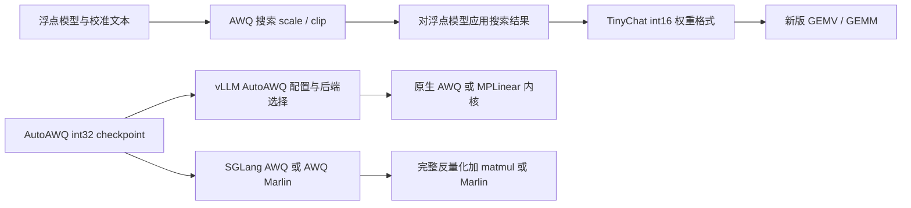

# AWQ 的实现核对：从量化脚本到 vLLM 与 SGLang

方法页回答 AWQ 为什么这样设计、证据支持什么；本页回答代码层面的事情：**量化脚本产出什么形状的权重、打包约定是什么、内核从哪里进入、同一个 AWQ checkpoint 在 vLLM 与 SGLang 里各走哪条路径**。这些内容决定一份 AWQ 权重能不能被目标引擎加载，以及加载后走的是哪类内核。

方法机制、论文数值与证据边界见 [AWQ：激活感知的权重量化](../methods/awq.md)。本页以固定源码核对为主，另用独立教学计算检查位序和轴转换；未运行仓库的量化脚本、模型或 GPU 内核。

## 1. 三个快照与读取范围

| 快照 | 固定版本 | 本页读取范围 |
|---|---|---|
| mit-han-lab/llm-awq | `d6e797a42b9ef7778de8ee2352116e0f48a78d61` | entry、校准数据、scale/clip 搜索、量化与打包、TinyChat 加载；新版 GEMV 数据与归约路径、GEMM 分派及 MMA/流水片段 |
| vllm-project/vllm | `568afb3a13806beb53bb2e6bd518269357b237c0` | AutoAWQ 配置、Dense 加载/转换/执行，MPLinear 选择与 Marlin 准备，AWQ 算子包装、Triton GEMM；MoE 只定位配置与转换入口 |
| sgl-project/sglang | `2f730e299f3b574e3bee2c6ef9669fa2a5b26dbc` | AWQ/Marlin 配置、Dense scheme/backend、JIT 反量化、权重与元数据重排；MoE 只定位配置与专家打包入口 |

下文以 Dense 线性层为主，$X\in\mathbb R^{M\times K}$、数学权重 $W\in\mathbb R^{N\times K}$、$Y=XW^T$。M 是展平后的 token 数；张量并行段落的 K、N 指本分片维度，另写 full K 才指全模型输入维。配置类、Python 包装、设备端内核各有额外约束，不能用上层声明代替下层核对。

图中两种 checkpoint 分列：本页已读路径没有提供 TinyChat v2 到两个服务框架格式的通用直接转换器；算法相同不代表文件可互换。

## 2. 原仓库：从搜索到加载的状态变化

`awq/entry.py:build_model_and_enc` 把三个产物分开处理：

| 入口 | 实际工作 | 产物含义 |
|---|---|---|
| `--run_awq --dump_awq` | 收集输入、搜索 scale/clip，保存后 `exit(0)` | 搜索记录，主要是带模块名的 scale 与 clip；不是低比特模型 checkpoint |
| `--load_awq` + `--q_backend fake` | 对浮点模型重放 scale/clip，再将权重替换成量化后反量化值 | 仍由浮点线性层执行，用于模拟精度；不允许同时 `--dump_quant` |
| `--load_awq` + `--q_backend real --dump_quant` | 生成整数码和元数据，替换成 WQLinear，保存 state_dict | TinyChat v2 权重格式，文件名被调整为 `*v2.pt` |
| `--load_quant` | 空模型中 `init_only=True` 建立 WQLinear 缓冲，再加载 checkpoint 并分派设备 | 加载已有产物，不重新搜索或校准 |

因此实际进入 `run_awq` 分支后，即使同时带其他选项，也不会越过保存后的退出点继续导出；只开 real 量化而未加载搜索结果，也不等于执行过 AWQ 激活感知搜索。`tinychat/utils/load_quant.py:load_awq_model` 同样先初始化量化模块再加载，`load_awq_llama_fast` 路径显式排除 lm_head。v2 文件名检查只是提示，不能替代内容验证。

**校准输入如何形成。** entry 实际传入 `n_samples=128,seqlen=512`；`run_awq` 的函数默认值与它不同。`get_calib_dataset` 读取 Pile validation，seed=42 打乱，跳过空文本及超过 512 tokens 的文本；先取指定条数，再拼接并按 block_size 切完整块，丢掉尾部。因此“128 条合格文本”不等于“128 个 512-token 块”，更不能填作论文所有实验的校准协议。

**每个 block 的顺序。** `pre_quant.py:run_awq` 先挂 hook 缓存各线性层输入，并在修改本 block 前计算下一块输入；再搜索缩放、应用缩放并同步修正缓存输入，最后搜索和应用裁剪。下一块校准沿修改前保存的输出推进，不是用最终整数模型逐块重放的误差传播。

`auto_scale.py:_search_module_scale` 用输入通道平均绝对值生成 20 个指数候选，每次以相同原始参数为起点，比较模块输出 MSE 并恢复参数。`auto_clip.py:auto_clip_layer` 则逐输出通道、逐组比较点积误差，取 1.00 至 0.55 的 10 个缩幅候选；按层名跳过 Q/K 等路径。两个目标的对象和归约方式不同，具体机制见 [方法页的缩放与裁剪](../methods/awq.md)。

**real 路径并非直接对原浮点权重做位移。** `real_quantize_model_weight` 先由 `pseudo_quantize_tensor` 产生已反量化的浮点网格值及 scale/zero，再由 `WQLinear.from_linear` 恢复整数码并 pack；`init_only` 分支只建缓冲，完全不走这一步。

## 3. 权重产物与打包约定

`qmodule.py` 定义了 AWQ 权重的**实际存储形状**，这也是跨引擎移植的关键：

| 项 | 实现（`qmodule.py`） | 含义 |
|---|---|---|
| `qweight` | int16 缓冲，形状 `(out_features/interleave, in_features//int16_pack_num*interleave)` | int16 只是打包容器；每元素实际占 `w_bit` 位 |
| 打包因子 | `pack_num = 32 // w_bit`、`int16_pack_num = 16 // w_bit` | 无符号打包口径；同一位宽在 32 位与 16 位容器下的分组数不同 |
| `scales` | 浮点缓冲，形状 `(G_pad, out_features)`；`G_pad = calculate_zeros_width(in_features, group_size) * 8` | 分组尺度先补齐宽度，再转置；并未按整数位打包 |
| `scaled_zeros` | 与 scales 同形、同 dtype，实际组处保存 `-zero * scale` | 内核用 `q * scale + scaled_zeros` 还原；该模块没有 `qzeros` 缓冲 |

这里 `scale_zeros = zeros * scales` 只是生成整数码时的临时量；保存到模块的 `scaled_zeros` 带负号，两者不能混用。`interleave=4`、`w_bit=4` 时 qweight 形状化简为 `(N/4, K)` 的 int16；形状约束还来自打包时的 `K//32`、`kstride=64` 重排。

`pack_intweight(unpacked_qweight, interleave, kstride)` 是离线重排函数：把 `(N, K)` 的未打包权重按 `32` 个一组的粒度重排后再打包。**这一步定义了 AWQ 自己的元素顺序**，它不是通用的「低半字节在前」约定——下一节会看到，这正是不兼容的来源。同文件的 WQLinear 构造器还检查 `in_features % group_size == 0` 等整除约束。

### 三种缓冲布局不能混用

| 表示阶段 | qweight | 零点/偏移 | scale |
|---|---|---|---|
| TinyChat v2 | int16，`(N/4,K)`，32 元素重排后按 4 行、64 步幅组织 | 浮点 `scaled_zeros`，`(G_pad,N)` | 浮点 `(G_pad,N)` |
| AutoAWQ checkpoint | int32，`(K,N/8)`，沿输出轴打包 | int32 qzeros，`(K/g,N/8)` | 浮点 `(K/g,N)` |
| vLLM MPLinear 转换后的标准输入 | int32，`(K/8,N)`，沿输入轴打包 | int32，`(N/8,K/g)`，输出轴打包并转置组轴 | 保持 `(K/g,N)`，再由所选内核转换 |

这里 g 是有效组长；`group_size=-1` 需先按具体路径解释为 full K，不能直接代入除法。TinyChat 的 pack 先对每 32 个输入元素重排，再在每 8 元素中采用 `[0,2,4,6,1,3,5,7]` 顺序，随后把四行与 64 输入跨度重新组织、每四个 nibble 合成一个 int16。不能仅更换张量 dtype 或转置完成格式迁移。

**可手算的 AutoAWQ 位序例子。** 逻辑码 `[0,1,2,3,4,5,6,7]` 按低位到高位排列为 `[0,2,4,6,1,3,5,7]`，得到 `0x75316420`。解包后用逆置换 `[0,4,1,5,2,6,3,7]` 才恢复逻辑顺序。vLLM 的 `_REVERSE_AWQ_PACK_ORDER` 和 SGLang 的 `argsort([0,2,4,6,1,3,5,7])` 表达同一个逆置换；打包序与逆置换不能互抄。

## 4. 内核入口

`qmodule.py` 的 forward 按输入规模分派：

- 展平后的 token 数 `M = x.numel() // x.shape[-1]` 小于 8 时调用 `awq_inference_engine.gemv_forward_cuda_new(...)`（该文件第 207 行附近）；
- 否则调用 `gemm_forward_cuda_new(...)`（第 218 行附近）。

内核源码位于 `awq/kernels/csrc/`：老路径在 `quantization/`（`dequantize.cuh`、`gemv_cuda.cu`、`gemm_cuda_gen.cu`），另一套在 `quantization_new/`（含各自的 `gemm/`、`gemv/` 子目录与 `dispatch_utils.cuh`）。同目录下还有 attention、layernorm、position_embedding 与 w8a8 内核，说明该仓库本身就是一个可运行推理端，而不只是量化脚本集合。

必须按导出名区分两套路径：`WQLinear.forward` 调用带 `_new` 的入口，对应 `quantization_new/`；`quantization/` 下旧内核的 int32 qweight、打包 qzeros 和 g64/g128 分派，不能作为当前模块的输入契约。新版 GEMV 仅接受 g128、M=1–7；新版 GEMM 的已读主机分支也固定 `G=128`。因此 Python 量化器能配置其他 group size，并不证明这套实际内核支持它们。具体布局与反量化机制见 [权重量化反量化内核的契约](weight-only-dequant-kernels.md)。

这与 [执行路径](quantized-matmul-scaling-execution.md) 的分类对应：AWQ 属于「打包权重 + 运行中反量化 + 浮点矩阵乘」，而 GEMV/GEMM 的分派正是对「解码受带宽限制、预填充受算力限制」这一差异的响应。

## 5. 跨引擎：vLLM

### 配置名怎样变成执行路径

`AutoAWQConfig.override_quantization_method` 在非 CPU 路径检测 checkpoint 的 `quant_method=awq`；用户未指定方法，或指定 `awq`、`awq_marlin`、`auto_awq`、`marlin` 时，均可统一到 `auto_awq`。因此这个快照中显式写 `awq` 不等于强制旧 AWQ GEMM。

`get_quant_method` 先处理跳过模块、lm_head 与平台分支。CUDA Dense 路径只有在未开启 `VLLM_BATCH_INVARIANT`、量化类型/组长/零点受支持，且层形状检查通过时进入 `AutoAWQMarlinLinearMethod`；否则使用普通 `AutoAWQLinearMethod`。CPU、XPU 和 RoutedExperts 各有独立分支，本页不据 Dense 结果推广。

### 普通 AWQ：256-token 分界

`AutoAWQLinearMethod.apply` 使用展平 M：

- `M >= 256`，或开启 `VLLM_BATCH_INVARIANT`：先 `awq_dequantize` 生成完整浮点 `(K,N)` 权重，再 `torch.matmul`。
- 其余情形：调用 `awq_gemm(..., split_k_iters=8)`；这里传入的 `pack_factor=8` 被作为 split-K 参数使用，不能解释成 GEMM 的权重位宽。
- 最后加 bias，并恢复输入前缀维度。

`_custom_ops.py` 再按 `VLLM_USE_TRITON_AWQ` 选择 Triton 包装或 `torch.ops._C`。因此类注释写“using Triton”并不能证明当前运行使用 Triton。已读 Triton GEMM 在 K 循环中解包、减零点、乘组尺度后 `tl.dot`；默认 32×32×32 tile，split-K 中间结果为 `(split_k,M,N)`，之后 `sum(0)`。它避免完整 `(K,N)` 反量化张量，却仍有部分和临时存储与归约成本。CUDA `_C` 版本的完整设备代码未在本轮重新核验。

### MPLinear：标准化后再选择内核布局

`AutoAWQMarlinLinearMethod` 的名字不保证最终为 Marlin。它构造包含全局/分片 shape、weight/activation dtype、组长、零点和 `has_g_idx=False` 的 `MPLinearLayerConfig`，由 `choose_mp_linear_kernel` 结合平台候选顺序、设备能力、`--linear-backend`、禁用列表及每个 `can_implement` 返回第一个可实现者；全部失败会报告原因。

加载流程是：

1. 按 AutoAWQ checkpoint 的 qweight/qzeros/scales 形状建立参数，保留 loader 的分片轴信息。
2. `_convert_awq_to_standard_format` 解包并撤销非标准位序；qweight 从 `(K,N/8)` 改成 `(K/8,N)`，qzeros 从 `(K/g,N/8)` 改成 `(N/8,K/g)`。
3. 委托所选 kernel 的 `process_weights_after_loading` 做该后端需要的进一步变换。

若选中 `MarlinLinearKernel`，它会在允许条件下补齐 tile 维度、调用 **gptq_marlin_repack**、重排 scales/zero-points，并建立 workspace 与空 g_idx。函数名里的 GPTQ 指输入布局协议，不代表模型重新用 GPTQ 量化。AWQ 本来没有 act-order，不应伪造置换。

**张量并行条件。** 普通 AWQ 创建缓冲时检查本分片 K 能否被有效组长整除、本分片 N 能否被 8 整除；Marlin 可补某些 tile 尾部，但不能靠 padding 修复一个量化组跨越 TP rank 的问题。须区分全局 shape、本分片 shape 与补齐后 shape，不能把模型原始维度直接传入分片内核。

## 6. 跨引擎：SGLang

**显式 `awq` 的语义与上述 vLLM 不同。** 此快照 `AWQMarlinConfig.override_quantization_method` 只在用户未指定、指定 `marlin` 或 `awq_marlin` 且兼容时升级；显式 `awq` 会保留普通 AWQ。普通 GPU 配置声明 float16、最低能力 7.5；Marlin 配置声明 float16/bfloat16、最低能力 8.0。不能把 JIT 辅助函数存在某 dtype 分支当作整个模型配置都已支持。

Marlin 层形状不支持时，Dense 回退至 AWQ；MoE 则可回退至 `MoeWNA16Config`。这些是代码分支，不是“成功加载任意 AWQ 模型”的保证。

SGLang 的 `AWQLinearScheme.create_weights` 保存 int32 `qweight`（`K × N/8`）、打包 int32 `qzeros`（`K/g × N/8`）与浮点 `scales`（`K/g × N`），并检查张量并行后的形状对齐。这也不是 TinyChat 的 int16 布局。

实际执行应继续追到 `hardware_backend/gpu/quantization/awq_kernels.py`：

- **普通 AWQ**：`AWQLinearKernel.apply` 先调用 `awq_dequantize(qweight, scales, qzeros)`，生成完整浮点权重，再 `torch.matmul`。Python 包装内部创建输出；带 `output` 参数的是它调用的底层包装函数。该路径有独立反量化中间张量，不能描述成融合式 W4A16 GEMM。
- **AWQ Marlin**：加载后分别重排 qweight、scales、zero-points，推理进入 `apply_awq_marlin_linear`。仅重排权重而忘记元数据也会破坏数值对应关系。
- **实现选择**：该快照的 CUDA 路径优先导入 JIT CUDA 包装；导入失败再尝试 Triton 和 sgl_kernel，HIP/XPU 另有分支。JIT 是编译时机，不等于 Triton 语言；不能据一个 JIT 文件推断所有平台都走同一路径。

**Marlin 的元数据重排是独立步骤。** 权重直接通过 `awq_marlin_repack` 从 AutoAWQ 转为 `(K/16,2N)` int32；scales 根据逐组/单组选择不同置换；`awq_to_marlin_zero_points` 先解包并撤销 AWQ 位序，再按 Marlin 顺序打包。vLLM 先标准化再走 GPTQ repack，SGLang 直接走 AWQ repack，两条链不同，目标都是与对应 Marlin 消费者一致的布局。

运行时 `apply_awq_marlin_linear` 传入空 g_idx、量化类型及 `is_zp_float=False`，普通 forward 使用 `gptq_marlin_gemm`，piecewise context 则走统一包装。`use_fp32_reduce` 默认 True，atomic-add 是否启用还看形状、设备与 dtype；不能把所有归约策略写成固定一种。

普通 JIT 反量化的设备路径每线程读一个 int32（8 个码），按 `row // group_size` 定位 scale/zero，撤销 nibble 顺序后计算 `(q-z)*s`，写回连续浮点权重。FP16 位技巧构造与减去 1024 得到 0–15，随后才施加零点和尺度；函数名 `s4` 不表示先还原为 −8–7。普通 AWQ backend 每次 apply 都生成完整反量化权重；Marlin 的 repack 则在加载后进行，不能把两者都记成“一次性转换”。

以上核对到固定源码的配置、数据变换与相应设备片段；尚未验证实际模型运行或跨引擎数值一致性。

## 7. 论文-代码对齐：本页补充的部分

方法页已记录三处论文与实现的差别（分析式与执行式不同、裁剪候选数与默认值、零通道下限）。代码核对再补两条：

- **论文的等价缩放与实现的打包约定是两层东西。** 论文只规定 `W → WD`、`X → D⁻¹X`；而 `interleave/kstride` 重排、`int16` 容器、`zeros*scales` 合成都是实现层的发明，任何跨引擎复用都必须按实现层核对。
- **仓库自带量化器之外的路径。** 该仓库还包含 `w8a8_linear.py`（`W8A8OF16LinearStaticScale` 与动态输入尺度版本），说明仓库同时支持 W8A8 执行，不能把 llm-awq 仅当作 W4A16 工具。

## 8. 可复用的实现要点

做同类实现或迁移一份 AWQ 权重时，按这个顺序核对：

1. **位打包约定**（容器类型、每容器元素数、元素顺序、打包轴），而不是先看量化公式；
2. **元数据宽度、dtype 与符号**（打包 zero-point 或浮点 scaled zero、是否转置和补齐）；
3. **反量化发生的位置**（内核内融合还是独立 kernel）；
4. **分派条件**（GEMV 与 GEMM 的切换阈值、batch 与形状约束、整除断言）；
5. **加载端是否要求标准顺序**（例如 vLLM 的转换函数）；
6. 最后才是超参数与校准数据是否一致。

## 9. 边界输入与验证状态

**从代码可定位的使用边界：**

- 官方 real 路径要求 `zero_point=True`、4 bit；虽然 WQLinear 构造器将 `group_size=-1` 转成输入维，`from_linear` 后续仍将原始 group_size 传入 `calculate_zeros_width`，其 −1 分支未实现。不能由构造器归一化推出完整 real 导出支持 −1。
- `pseudo_quantize_tensor` 的对称分支在定义 min_val 前执行 `assert min_val is None`；这是所读快照的静态缺陷，不能作为可用对称量化入口。本轮没有修改上游源码。
- clip 的抽样步长为 `token_count // n_sample_token`，默认 n_sample_token=512；少于 512 个 token 时步长为零。输出通道还需满足代码的 256/64 分批条件。
- 新版 GEMV 对非 g128 显式报错；GEMM 固定按 g128 解释参数。GEMM 启动沿 N 使用 `N // 128`，故 WQLinear 的 `N % 8 == 0` 检查不足以覆盖全部实际调用要求；非 128 倍数的 N 需单独处理和验证，不能宣称已有通用尾块支持。

**已检查：**代码链、shape/dtype/位序、加载与运行时转换时机；独立教学计算验证 `0x75316420` 例子、AutoAWQ 权重/零点轴转换及 TinyChat 4 行/64 步幅打包的往返关系。教学计算模拟整数布局，不等于运行原 PyTorch pack 或 CUDA 内核。

**待验证：**用同一份模型和校准数据导出后逐层比较；实际 GPU 上 GEMV/GEMM/Marlin 的数值与性能；FP16/BF16 舍入和 split-K 归约差异；全部模型适配、MoE 专家路由、TP 加载及 TinyChat 生成服务。本轮未配置相关运行环境，也未把源码阅读表述为复现成功。

## 来源身份

下表用于在没有本地资料库时辨识来源；具体论述的章节、公式、图表或代码位置见正文。

| 来源 | 版本或快照 | 说明 |
| --- | --- | --- |
| [mit-han-lab/llm-awq](https://github.com/mit-han-lab/llm-awq/tree/d6e797a42b9ef7778de8ee2352116e0f48a78d61) | `d6e797a42b9ef7778de8ee2352116e0f48a78d61` | — |
| [vllm-project/vllm](https://github.com/vllm-project/vllm/tree/568afb3a13806beb53bb2e6bd518269357b237c0) | `568afb3a13806beb53bb2e6bd518269357b237c0` | — |
| [sgl-project/sglang](https://github.com/sgl-project/sglang/tree/2f730e299f3b574e3bee2c6ef9669fa2a5b26dbc) | `2f730e299f3b574e3bee2c6ef9669fa2a5b26dbc` | — |
