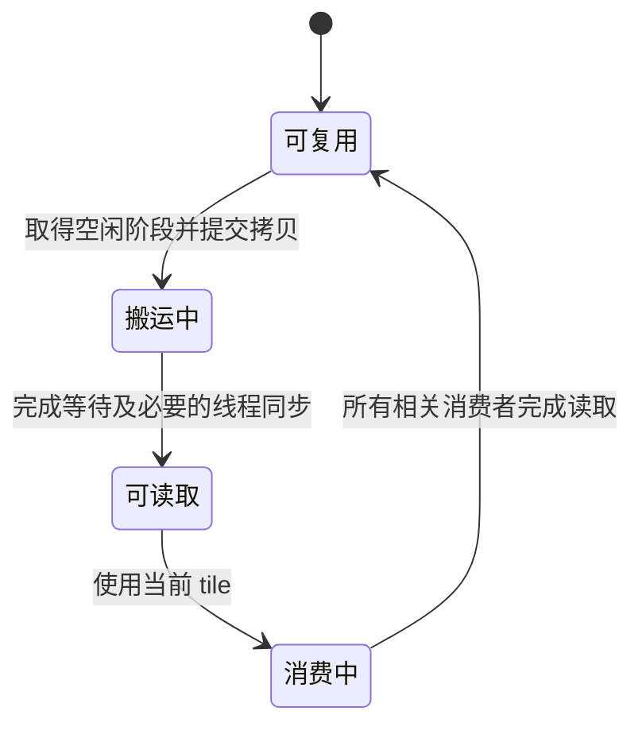

# GPU 异步拷贝与多级流水：等待完成和缓冲复用

异步拷贝把“发起数据搬运”和“数据已经可用”分开，让线程有机会在等待下一块数据时计算当前块。多级流水进一步复用有限的 shared 缓冲；正确性必须同时保证两件事：读取之前搬运已完成，覆盖之前旧消费者已读完。

本页展开 `Optimize Shared Memory Tiling` Skill 的双缓冲建议，用 CUDA 文档 LDGSTS/Prefetching Data 与 CuTe SM80 包装、SGEMM 流水片段核对。先读 [GPU 存储与同步](../fundamentals/hardware/gpu-execution-and-memory-hierarchy.md)。本页讨论普通 `cp.async` 的 global→shared 路径，不把其等待规则直接套给 TMA、异步 MMA 或其他架构机制。

## 1. 异步搬运减少什么依赖

传统路径可以先从 global 读到线程寄存器，再由线程写入 shared；LDGSTS 对应的 SM80+ `cp.async` 可直接发起 global→shared 搬运，减少中转寄存器并允许后续独立指令继续执行。它不会让所搬的数据更早成为“无需等待就可读取”的数据。

CUDA 快照 §4.11.1 说明拷贝单位为 4、8 或 16 字节，源/目标需满足相应对齐。向量化之前要检查实际指针、每行步长和尾部长度；基础分配地址对齐不代表偏移后的地址也对齐。`aligned_size_t` 一类对齐证明应来自真实布局，不能凭希望提供错误假设。

即使 API 是异步的，实际重叠程度也由硬件、依赖和编译决定。只有搬运之后存在独立工作，且资源足够时，延迟才可能被隐藏。

## 2. 一个缓冲区有四个状态

`producer_acquire`、`producer_commit`、`consumer_wait`、`consumer_release` 表达这种生命周期，但具体保证取决于 pipeline 的作用域和参与方式。CUDA Prefetching Data 示例使用线程局部 pipeline；线程各自等待并不足以说明整个 CTA 的拷贝都完成，数据由其他线程读取时还需要块级协调。

写后屏障与读后屏障保护不同方向的依赖。前者防止读到未完成的数据；后者防止快线程覆盖慢线程还在读取的 tile。增加两个 buffer 只提供空间，不自动建立这些依赖。

## 3. `commit_group` 与 `wait_group` 等待的是批次

CuTe `copy_sm80.hpp:cp_async_fence` 发出 `cp.async.commit_group`，将线程此前尚未提交的拷贝归成一组；提交不阻塞等待完成。同文件 `cp_async_wait<N>` 包装 PTX 等待：允许最近 N 组仍待完成，较早的组必须完成。N=0 在这个 CuTe 包装中使用 `wait_all`；不要据包装名称假定它与任意手写的未提交操作序列完全相同。

关键对象是**当前线程已提交批次的顺序**，不是“第几个 shared buffer”。`wait_group(1)` 不保证最新一组已完成，也不替其他线程等待；提交后马上调用它，再读取刚提交的数据，可能仍过早。

教学推演中，用 g0/g1 标记按顺序提交的组：

| 此时的批次 | 执行的等待 | 保证可以消费什么 |
| --- | --- | --- |
| 只有 g0，尚可能在途 | wait_group(1) | 允许 g0 继续在途，不能据此读取 g0 |
| g0、g1 均已提交 | wait_group(1) | g0 必须完成，g1 可在途 |
| 当前只需等待最后的 g1 | wait_group(0) | 所有已提交组完成，包含 g1 |

因此不能从“双缓冲”三个字固定推出等待参数永远为 1。参数取决于预取了几组、即将消费哪一组，以及循环收尾是否还保持批次计数。

## 4. 启动、稳态和收尾要分别推演

以两份缓冲 b0/b1、tile 0/1/2 为例，一种概念性流程是：

1. 启动时将 tile 0→b0、tile 1→b1 分别提交为 g0/g1。
2. 等待较早 g0 完成，完成相关线程同步后消费 b0；g1 可以仍在搬运。
3. 确认 b0 的旧读取全部结束，才把 tile 2 提交到 b0；接着等待并消费 b1。
4. 重复时始终把“逻辑 tile 编号、物理 buffer 编号、提交组编号”分开追踪。
5. 最后没有未来 tile 可补入时，需加强等待排空剩余组，或采用有证明的空组提交方案维持批次距离。

第 5 步是容易漏掉的边界。CUDA 文档的 Prefetching Data 示例预填 L 个阶段，在循环中等待 `L−1` 个允许待完成批次；即使没有新的数据，它仍 commit 空批次，以维持该固定等待参数的语义。直接删去空 commit 而保留原等待距离，可能使收尾读早。短于预填阶段数的输入还必须单独保护，不能无条件读取不存在的 tile。

另一种正确设计可以每轮先确认当前 tile 已就绪，再发起下一 tile 搬运，随后计算当前 tile。即使阶段边界用了等待全部，也可能让之后发起的搬运与当前计算重叠。因此 Skill 中“wait_group(0) 必然消除所有重叠”并不是通用规则；必须看等待、提交和计算的相对位置。

## 5. 官方实现为什么可能采用不同等待距离

CuTe `examples/cute/tutorial/sgemm_sm80.cu` 先预取 `K_PIPE_MAX−1` 个 shared 阶段，再用 `cp_async_wait<K_PIPE_MAX−2>()` 等待较早阶段；另外还有 shared→register 的片段预取。主循环把 global→shared、shared→register 和 register 上的 GEMM 交叠起来。

这与 CUDA 文档示例预填 L 份缓冲后等待 L−1 的做法不同，原因是预填数量与循环结构不同。可复用的是“目标 tile 处于已经完成的那部分组中”，不是复制某个固定常量。本轮定向核对了这些预取、等待、轮换和计算片段，没有验证完整 CuTe GEMM 对所有形状的正确性。

## 6. 多阶段用空间换时间，也可能变慢

设串行处理 Q 个 tile，每块搬运耗时 $t_m$、计算耗时 $t_c$。忽略调度、同步和资源竞争时，串行约为 $Q(t_m+t_c)$；有充分预取和缓冲的理想流水可接近

$$t_{\rm pipeline}\approx t_m+t_c+(Q-1)\max(t_m,t_c).$$

这是整理者构造的双阶段重叠模型，不是 GPU 延迟预测。Q 很小时，启动和排空占比大；搬运与计算不能充分并行，或 shared/寄存器用量降低驻留时，实际收益会更小甚至为负。

多一份 A/B 缓冲的空间成本约为 $eB_K(B_M+B_N)$，还要算 padding 和同步状态；这会改变 [配置与驻留上限](kernel-configuration-and-autotuning.md)。此外，每个阶段必须满足各自的对齐、边界和数据布局要求。异步拷贝不会修复 bank conflict，也不会替低比特码执行正确解包。

## 7. 如何核对一条真实流水线

从实际调用入口列出每个阶段的缓冲与消费者，然后沿一次启动、两次轮换和最后一次消费，核对以下事实：何时提交、等待覆盖哪组、其他线程何时可见、何时允许覆盖。特别检查只有一个 tile、少于流水深度、不规则尾块和多轮复用的输入。

数值参考能发现部分读早/覆盖问题，却不能证明没有竞争；GPU 上还需编译、设备诊断和实际计时。软件状态模型只能验证既定顺序下的逻辑关系，不能模拟 GPU 内存模型。

本轮已用 CPU 状态推演验证组等待反例、短流水启动/排空与环形 buffer 复用关系；未运行 CUDA、未执行竞争诊断或性能测量。已有 [AWQ 新版 GEMM](weight-only-dequant-kernels.md) 的 cp.async/MMA 片段可据此继续理解，但未因这轮知识补充升级为本地运行验证。

## 来源身份

| 来源 | 固定版本或快照 | 使用范围 |
| --- | --- | --- |
| [tensormux/kernel-skills](https://github.com/tensormux/kernel-skills/tree/7b7337a123f8711aa8e3d0452351d8fd30dde4b7) | `7b7337a123f8711aa8e3d0452351d8fd30dde4b7` | 本页列出的 Skill 提供待解释的问题和经验建议，具体主张经官方材料核对。 |
| [CUDA Programming Guide：Asynchronous Data Copies](https://docs.nvidia.com/cuda/cuda-programming-guide/04-special-topics/async-copies.html) | `snapshot-2026-07-02`，获取于 `2026-07-02T02:31:16+08:00` | LDGSTS、预取及线程间共享的同步条件；章节号以本地快照为准。 |
| [NVIDIA CUTLASS/CuTe](https://github.com/NVIDIA/cutlass/tree/e8ecfad75b44d1ad56264f5001d877e9e47fe080) | `e8ecfad75b44d1ad56264f5001d877e9e47fe080` | SM80 异步拷贝包装和 SGEMM 流水片段；未运行。 |
