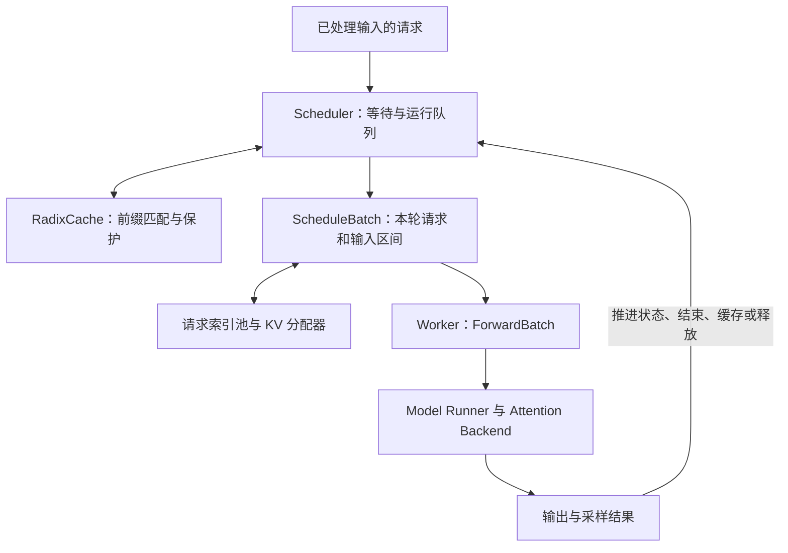

# SGLang 推理执行：Radix 缓存、批次调度与重叠执行

SGLang 的推理执行把请求、前缀复用、显存槽位和设备批次连接起来：Radix cache 找到可复用的历史 KV，调度器选择本轮 extend 或 decode 工作，内存池建立请求位置到 KV 槽位的映射，worker 再把调度批次交给模型执行。重叠调度进一步让 CPU 准备与 GPU 计算并行推进。

本页基于所收录的固定源码，选择普通自回归生成、MHA/GQA、设备内 RadixCache 的主线。从已完成输入处理的请求进入 Scheduler 开始，不展开前端编程接口、分布式路由、HiCache 分层存储或原始 SGLang 论文的实验。分页与连续批处理基础见[内存管理与批处理](serving-memory-and-batching.md)，算子侧接续到[SGLang Attention 设计](sglang-attention-operator-design.md)。

模型计算的共通前置见 [Transformer 与自回归推理](../fundamentals/model/transformer-autoregressive-inference.md)；模型内各 rank 怎样分担投影见 [张量并行与量化](tensor-parallel-quantization.md)。本页的缓存和重叠机制最终需用 [服务延迟与 goodput](serving-performance-evaluation.md)判断收益。

## 1. 从调度批次到模型批次

`Scheduler.event_loop_normal` 依次接收请求、处理请求、`get_next_batch_to_run`、`run_batch`、`process_batch_result`。`ScheduleBatch` 保留请求对象和调度状态；worker 的 `forward_batch_generation` 通过 `ForwardBatch.init_new` 构造本轮模型输入，再调用 `ModelRunner.forward`。二者的职责不同，不能把修改请求队列等同于 GPU 输入已经就绪。



`ForwardMode` 明确区分 EXTEND、DECODE、MIXED 等模式。EXTEND 表示在已经可用的前缀上继续计算一段 token，也覆盖完全没有缓存命中的 prompt；普通 DECODE 每请求处理一个 token；MIXED 包含本轮新扩展段与已运行请求的 decode token。不同模式使下游能够选择不同的元数据和算子路径。

## 2. Radix tree 保存的是前缀关系与 KV 索引

普通 `RadixCache` 用压缩前缀树表示已缓存的 token 序列。节点的 key 可以是一段 token，value 是这段 token 对应的 KV 槽位索引；实际 K/V 数值由 KV pool 保存。`match_prefix` 返回沿匹配路径拼接的 `device_indices` 和末节点。树检索本身不会替每个 Attention head 执行乘加。

**教学例子：**缓存已有 token 序列 `[a,b,c,d]`，新请求是 `[a,b,x,y]`，假设 page size=1、身份条件相同。最长前缀是 `[a,b]`。树可以把原节点拆为共同节点 `[a,b]` 与原后缀 `[c,d]`，新后缀另接 `[x,y]`。`_split_node` 会复制/切分索引张量，但不因此复制对应的所有层 K/V 数值；两个请求的共同前缀仍可引用同一批槽位。

树从根出发的路径保留完整前文，所以相同的局部后缀出现在不同上下文时不会仅因 token 相同而共享。`RadixKey.extra_key` 还提供身份命名空间，不同 extra key 的相同 token 序列保持分离。普通匹配在 page size>1 时按页对齐；这也是为什么“文本看起来相同”不等于所有长度和配置下都能复用相同数量的 token。

`Req.init_next_round_input` 用命中的索引准备下一轮。其 `_compute_max_prefix_len` 将通常的匹配上限设为输入长度减一，保留末 token 的前向来生成 logits；返回 prompt logprob 等要求会进一步约束命中范围。缓存 KV 不等于缓存了所有所需的输出。

## 3. 命中、保护与淘汰是三个不同动作

前缀匹配告诉调度器“哪里存在可复用内容”；进入执行前，还要保证这些槽位不会在使用期间被回收。

`inc_lock_ref` 从匹配末节点沿祖先增加锁引用。节点从零引用变为受保护时，其大小由 evictable 转为 protected；`dec_lock_ref` 在最后一个使用者释放时做逆向转换。锁表示缓存生命周期，不是 CUDA kernel 的线程同步原语。

`evict` 从可淘汰叶节点中按配置策略选择，释放 value 指向的 KV 槽位并删除叶子；当父节点也变成无子节点、无锁的叶子时，才继续把它列为候选。这样不会为回收一段共享前缀而留下依赖它的活跃路径。

`cache_unfinished_req` 和 `cache_finished_req` 处理的也不只是“把 token 放入树”：

- 插入时可能发现某段已存在，重复分配的 KV 槽位应释放，继续运行的请求映射要更新为树中的规范索引。
- 未完成请求需要迁移锁的保护范围，同时保留下一轮仍要使用的部分页。
- 完成请求按已提交的 KV 长度插入可缓存段，释放不能入树的未对齐尾部，并释放该请求的锁。树持有的可复用槽位可继续存在，等待以后命中或淘汰。

因此“请求结束”“节点解锁”“KV 槽位回到分配器”不要求同时发生。缓存能够保留历史内容，也会占用潜在可分配容量；`available_size + evictable_size` 表示可利用的容量来源，不应再把 protected 部分加进去。

## 4. 调度同时约束本轮计算和未来 KV 需求

`get_next_batch_to_run` 的普通主线先尝试得到新的 prefill/extend 批次，成功则运行它；否则更新 running batch 并执行 decode。是否接纳由 `PrefillAdder`、请求池、内存池和调度策略共同决定，不能将这一分支顺序理解为无限制地让新请求压住 decode。

`PrefillAdder` 区分几个预算：

| 预算或约束 | 控制对象 | 作用 |
| --- | --- | --- |
| 输入 token 预算 | 本轮新扩展的计算量 | 限制一次 prefill 聚合的工作 |
| chunk token 预算 | 分段 prefill 的本轮长度 | 允许长请求逐轮推进 |
| 可分配与可淘汰 KV 容量 | 设备状态空间 | 保证输入、后续生成预留和对齐开销有空间 |
| 请求池和并发请求上限 | 活跃请求状态 | 空有 token 容量也不能超出请求槽位 |

所读 `add_one_req` 的普通分支会把候选完整剩余输入、截断后的剩余生成额度与页对齐余量纳入接纳检查；running 请求的未来预算还涉及 `new_token_ratio`。chunk 限制的是本轮计算，不表示一定只需要为这个 chunk 考虑内存。对无 chunk 的首个 prefill 请求，源码还存在避免单个长请求无法被接纳的输入预算例外，所以 `max_prefill_tokens` 不能被当作所有分支均严格满足的代数上界。

缓存锁还会改变接纳结果：`add_one_req` 临时锁住命中路径后会再检查剩余容量，因为原来可淘汰的块已转为保护状态。这说明“命中无需重新生成 KV”与“命中的缓存可以被淘汰来给新工作腾空间”不能同时成立。

启用 mixed chunk 且条件允许时，`mix_with_running` 将运行请求各一个 decode token 接到 extend 批次，给这些请求追加长度为 1 的扩展区间。chunked prefill、mixed batch 和 CPU/GPU overlap 分别改变单请求工作长度、批次成员组合和执行时序，不能统称为同一个优化。

当 decode KV 不足时，`update_running_batch` 可调用 `retract_decode`，将回退请求重新入队并调整生成预留比例。由此可见，省下权重显存后能否扩大有效并发，还取决于请求长度、KV 预留、缓存保护和算子负载，不能只看模型文件大小。

## 5. 请求位置怎样映射到实际 KV

`ReqToTokenPool` 为请求分配 row，`req_to_token[row, position]` 保存 token 的 KV 槽位。KV pool 再以 layer、slot、head 等维度取得数值；具体形状与 stride 由 pool/backend 决定。Radix 前缀树提供可复用索引，这张请求映射则提供当前执行的完整位置序列。

`ScheduleBatch.prepare_for_extend` 只将各请求未复用的 token 拼入本轮输入，记录 prefix/extend 长度；`mem_cache/common.py::alloc_for_extend` 分配新槽位，并通过 `write_cache_indices` 将前缀索引与新槽位写回请求映射。`out_cache_loc` 指明本轮新 K/V 的写入位置。

**教学例子：**page size=1、A/B 都复用前两个 token 的槽位 `[8,9]`，A 本轮扩展 2 个 token，B 扩展 1 个，假定新分配槽位为 `[20,21,30]`：

```text
请求 A 的映射： [8,9,20,21]    prefix=2, extend=2, seq_len=4
请求 B 的映射： [8,9,30]       prefix=2, extend=1, seq_len=3
本轮输入：     [A2,A3,B2]
out_cache_loc: [20,21,30]
```

线性层处理本轮 3 行，Attention 还要分别读取 A/B 的历史。共享 `[8,9]` 省去重复保存与前向，但两个请求的新 query 仍分别对历史 KV 做注意力；不能从共享前缀直接推出 decode 不再读取该前缀。Triton 对这张映射的展平方式见[Attention 元数据与 extend 路径](sglang-attention-operator-design.md)。

## 6. 重叠执行怎样保留自回归依赖

`event_loop_overlap` 维护结果队列：准备并提交当前批次，将批次副本与结果入队，再处理上一批次结果。`run_batch` 使用 forward stream 等待 schedule stream 的准备工作；结果的主机拷贝与处理另有完成事件和时序。CPU 可以提前做部分调度准备，但同一请求的下一次前向仍依赖上一次采样的 token。

`overlap_utils.FutureMap` 用请求池索引保存跨轮结果。普通 decode 的 `resolve_forward_inputs` 从设备端 `output_tokens_buf` 取下一轮 token；prefill 从 pinned CPU 输入复制，MIXED 将这两部分拼接。这个机制减少了“先把 token 拷回 CPU、再构造 GPU 输入”的依赖，不是预测尚未生成的真实 token。

重叠还要求延长张量生命周期并防止调度修改 GPU 正在读取的状态。所读 `run_batch` 的 `_forward_isolation` 与 `record_batch_in_overlap` 保留 forward 所需引用、隔离相应状态；完成事件用于约束结果读取。按位置识别请求不可靠，因为每轮批成员和顺序会变，跨轮转交以请求池身份为基础。

一个忽略同步与准备依赖的理想流水教学模型：若每轮 CPU 准备耗时 C、GPU 执行耗时 G，串行 N 轮约为 $N(C+G)$；能充分重叠时约为 $C+G+(N-1)\max(C,G)$。这仅说明减少空隙的机会，不是 SGLang 的实测速度。采样约束、内存资源和首 token 延迟目标都可能限制重叠；源码也允许特定批次关闭 overlap。

## 7. 与已有 vLLM 知识怎样衔接

[vLLM 推理执行](vllm-inference-execution.md)围绕 token 进度、块管理与紧凑输入展开；本页提供另一种具体组织：EXTEND/DECODE/MIXED 模式、Radix 路径保护、请求到 token 槽位映射和结果转交。两者都需要保证缓存身份、资源可用性、请求边界和新旧状态顺序。这些共同要求有助于定位实现差异，但不能仅由数据结构名称判断吞吐高低。

本轮研读上述源码，完成索引、缓存状态和重叠时间公式的 CPU 教学核对；未启动 SGLang 或测量服务性能。普通 RadixCache 的结论不直接推广到 Mamba、SWA、HiCache、推测解码或分布式 KV 传输。

## 来源身份

| 来源 | 固定版本 | 使用范围 |
| --- | --- | --- |
| [sgl-project/sglang](https://github.com/sgl-project/sglang/tree/2f730e299f3b574e3bee2c6ef9669fa2a5b26dbc) | `2f730e299f3b574e3bee2c6ef9669fa2a5b26dbc` | 普通 Scheduler/PrefillAdder、批次转换、RadixCache、请求与 KV pool、overlap 结果转交；符号位置见各节。 |
