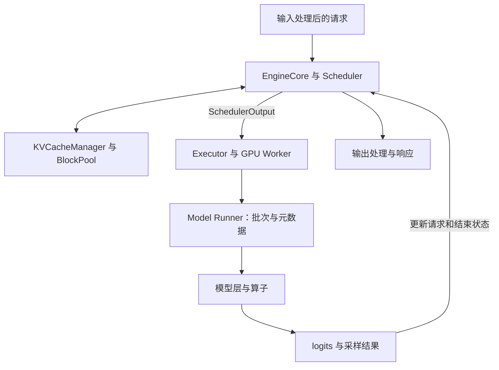

# vLLM 推理执行：从 token 调度到变长批次

vLLM 把持续到达、长度不同的请求组织成一轮轮 GPU 工作。核心联系是：调度器决定本轮计算哪些 token，KV 管理器提供可用的历史状态和写入空间，model runner 把这些决定变成紧凑张量、位置和块表；模型执行后再将输出交回调度器推进请求。

本页研读 raw 固定快照中的 V1 路径，以普通 decoder-only、全注意力、无推测解码的请求为解释主线。多进程职责依据 `docs/design/arch_overview.md`；执行链依据 `EngineCore.step`、`Scheduler.schedule` 和 `GPUModelRunner`。分页原理及原始论文实验复用[内存管理与批处理](serving-memory-and-batching.md)，Attention 接口和设备计算接续到[vLLM 算子设计](vllm-attention-operator-design.md)。

## 1. 请求状态与模型执行为什么分开

在线服务中，API 侧处理输入和输出流；EngineCore 管理等待/运行请求、调度和 KV 块；executor 组织 worker 执行，worker 内的 model runner 准备模型输入。它们分别面对请求生命周期、资源分配和设备执行三个问题。架构文档描述了多进程部署；单机、不同 executor 的进程组织不能由下面的逻辑图一概推出。



`EngineCore.step` 先 `schedule()`，再通过 executor `execute_model()`；需要时调用 `sample_tokens()`，最后 `update_from_output()`。调度输出携带本轮 token 数和请求/KV 更新信息，而不是为每个请求单独调用整套模型。异步批队列是另一种重叠执行组织，本页不展开其完整时序。

这种划分使算子不必管理“HTTP 请求何时结束”，调度器也不必实现矩阵乘法。但双方通过 token 数、KV 生命周期和元数据契约相互约束：算子更快不代表调度、输入准备和通信都同步加速。

## 2. 统一的 token 进度怎样容纳 prefill 与 decode

`Scheduler.schedule` 的主抽象是每个请求的**目标 token 数与计算进度之差**。忽略推测 token、异步占位和模型长度上限时，令请求 i 的已知 token 数为 $n_i$、本轮开始前的计算进度为 $c_i$，待做工作为 $n_i-c_i$。本轮选择 $q_i$，受到剩余 token 预算 T、长 prefill 阈值及 KV 可分配性的共同约束：

$$0\le q_i\le n_i-c_i,\qquad \sum_iq_i\le T.$$

这是对源码主线的简化表达。实际代码还处理并发请求数上限、最大模型长度、encoder 预算、推测 token 与其他状态。`num_computed_tokens` 在 `_update_after_schedule` 中就会前推，异步时还会登记 `num_in_flight_tokens`；因此这个字段不是“GPU 已经完成”的同步凭据。

| 请求状态 | 简化下的待做工作 | 一轮之后 |
| --- | --- | --- |
| 新 prompt | 可能有很多 token 尚未计算 | 处理整个 prompt 或其中一段 |
| 未完成的 prefill | 上一轮剩余的 prompt 后缀 | 沿同一进度继续 |
| 普通 decode | 上次刚生成的 token 尚未进入下一次前向 | 计算它的 KV 与隐藏状态，再预测下一个 token |
| 命中共享前缀 | 从命中的计算进度继续 | 只处理未复用的部分 |

`schedule` 先遍历 running，再在剩余资源允许时接纳 waiting。running 中也可能有尚未完成的 prefill，所以这不是“任何情况下 decode 都有绝对优先级”的承诺。连续批处理意味着每轮成员可变；chunked prefill 则允许一个 prompt 分多轮计算，两者分别改变批成员和单请求的本轮工作量。

**教学例子：**预算 T=8，已运行请求 A 需 1 个 decode token，B 还有 12 个 prompt token。假设按 A、B 顺序、启用切分且 KV 足够，可分配 A=1、B=7；B 剩余 5 个 prompt token 留待后续。若禁用切分，新 waiting 请求所需 token 超过剩余预算时，源码的接纳路径可以停止，而不是强行超预算。

切分避免一次长 prompt 独占很大的计算轮次，但会增加轮数与准备开销；更大的单轮预算有利于形成较大的矩阵，却也可能拉长其他请求等待本轮结束的时间。这是由工作划分导出的取舍，收益需要真实负载下的首 token 延迟、逐 token 延迟和吞吐测量，不能从 T 单独推出。

## 3. token 预算之外，还要满足 KV 空间约束

`KVCacheManager.allocate_slots` 检查块需求及可用容量，不足时返回 `None`。调度器可能抢占已有请求，释放其资源并重新排队；`_preempt_request` 重置计算进度，恢复时可利用仍可命中的缓存或重新计算。这是本页所读代码路径，不能将原始论文讨论的 CPU swap 自动写成这里的执行分支。

对一个未共享、已分配块数恰好覆盖 c 个 token 的普通请求，设每块 b 个 token，本轮追加 q 个，新增块数的教学模型为

$$\Delta B=\left\lceil\frac{c+q}{b}\right\rceil-\left\lceil\frac{c}{b}\right\rceil.$$

例如 b=4，c=7 时追加 1 个 token 不必新分块；c=8 时再追加 1 个则需要新块。真实分配还要计入缓存命中、多个 KV 组、lookahead、预留空间与 watermark，不能直接用这个简式替代管理器。

这解释了两个限制为何独立：有 token 预算的请求仍可能没有 KV 空间；有 KV 空间也不代表适合无限增大本轮计算量。内存容量、每轮时间和调度公平性需要共同考虑。

## 4. 前缀复用的身份与生命周期

普通全注意力路径以完整块为前缀命中单位。`kv_cache_utils.hash_block_tokens` 将父块哈希、当前块 token 和额外身份信息纳入键；额外信息可含 LoRA、多模态内容或 cache salt。相同的局部 token 片段如果前文不同，其 K/V 通常也不同，因此不能只按当前块的文本判重。

`BlockPool` 把“当前被请求引用”和“仍可作为缓存复用”分开：

| 操作 | 源码中的作用 | 设计含义 |
| --- | --- | --- |
| 命中后的 `touch` | 增加引用计数；必要时移出空闲队列 | 防止正在使用的块被当作可淘汰资源 |
| `free_blocks` | 减少引用计数，归零后进入可再分配队列 | 请求结束不要求立即丢弃缓存身份 |
| `get_new_blocks` | 取可用块，并移除旧缓存哈希 | 同一物理空间被覆盖前，旧前缀身份必须失效 |

这里的“free”主要是块池的可分配状态，不是每次请求结束就向 CUDA 释放底层显存。可复用的哈希缓存块也可能处于引用数为零的状态；它在被重新占用前仍有命中价值。

命中 prompt 的所有 KV 也不直接提供下一 token 的 logits。`get_computed_blocks` 将最大命中长度限制为 `request.num_tokens - 1`，保留末 token 的前向；完整块对齐可能使重算范围大于一个 token。这来自 KV 所保存的信息范围，并不表示前缀缓存失效。

共享前缀省去的是前缀的重复前向与 KV 写入；后续新 query 仍需对允许访问的历史 KV 计算注意力。减少 prefill 工作与减少每步 decode 的历史读取量不是同一件事。

## 5. 从请求列表变成紧凑张量

`GPUModelRunner._prepare_inputs` 根据本轮各请求的 q 拼接输入，并生成位置、累积 query 起点和序列长度。普通主线的关系为：

$$Q_0=0,\quad Q_{i+1}=Q_i+q_i,\quad p_{i,j}=c_i+j,\quad \ell_i=c_i+q_i.$$

`query_start_loc` 保存 Q，描述每个请求在本轮 query 张量中的切片；`seq_lens` 保存 $\ell_i$，描述当前可用的 KV 长度。二者不等长，也不表达相同的量。

**教学例子：**A 的 c=7、q=1，B 的 c=2、q=3：

```text
本轮拼接 token:   [A7, B2, B3, B4]
positions:       [7,  2,  3,  4]
query_start_loc: [0, 1, 4]
seq_lens:        [8, 5]
```

线性层可将这 4 个 token 当作矩阵的 M=4 行一起计算。Attention 则必须恢复请求边界，并读入 A 的历史 8 个 KV、B 的历史 5 个 KV，按每个 query 的绝对位置施加因果约束。即使 q 相同，不同历史长度也会带来不同的 Attention 工作量。

未启用推测解码时，runner 用 `query_start_loc[1:] - 1` 选各请求本轮最后一行作为 logits 位置；尚未完成 prompt 的分段不会因此产生有效的用户输出，代码会忽略相应采样结果。**执行了一段 prompt**和**可以生成回答 token**是两个不同状态。

`block_table` 将每个请求的逻辑 KV 块映射到物理块；`slot_mapping` 则把本轮每个新 token 映射到写入槽位。在单设备、管理块与 kernel 块相同的简化情况下：

$$\mathrm{slot}(i,p)=\mathrm{block\_table}[i,\lfloor p/b\rfloor]\,b+(p\bmod b).$$

若 b=4，A 的块表为 [10,3]、B 为 [6,12]，上例对应槽位 [15,26,27,48]。它是 **token 槽位编号**，还需 backend 的 head、dtype 和 stride 布局才能得到实际字节地址。源码 `worker/block_table.py` 还处理 kernel block 转换与 context parallel，本例不覆盖这些扩展。

## 6. 调度怎样改变算子优化问题

对于同一模型，线性层的 M 主要由本轮 token 总数决定；Attention 的负载还受每个请求的 query 长度、历史长度、head 数和掩码影响。所以仅以“batch size=几”描述一个 serving kernel 基准不够，至少要分清请求数、总 token 数、各 query 长度与 KV 长度。

在上面的 A/B 例子中，prefill 与 decode 可以共用一次模型前向，但其 Attention 访存与可利用的 query 复用不同。算子分派、图执行和测量需要保留这种工作负载差异；实现见[Attention 后端、在线 softmax 与图执行](vllm-attention-operator-design.md)。权重量化的格式转换和内核选择复用[AWQ 实现页](awq-implementation.md)，避免将调度机制重复写成另一份 AWQ 分析。

SGLang 对同类问题的组织见 [Radix 缓存、批次与重叠执行](sglang-inference-execution.md)：可沿前缀身份、受保护缓存、输入索引与跨轮结果四个问题继续阅读，而不将两套框架的字段名称直接等同。

本轮完成固定源码主线研读及 token/槽位教学计算；未启动 vLLM、运行模型或测量服务延迟。多模态 encoder、Mamba、分布式 KV 传输、推测解码和完整异步调度不在本页的机制覆盖范围。

## 来源身份

| 来源 | 固定版本 | 使用范围 |
| --- | --- | --- |
| [vllm-project/vllm](https://github.com/vllm-project/vllm/tree/568afb3a13806beb53bb2e6bd518269357b237c0) | `568afb3a13806beb53bb2e6bd518269357b237c0` | 架构文档、V1 EngineCore/调度、KV 管理及 GPU 输入准备；具体文件和符号见各节。 |
